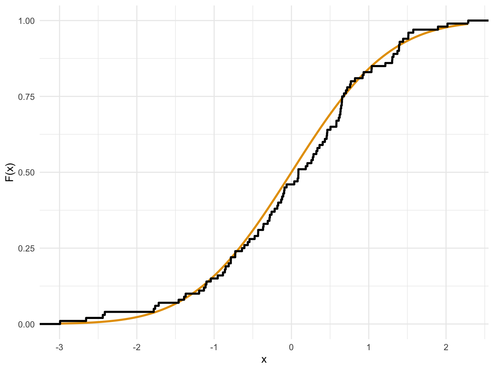
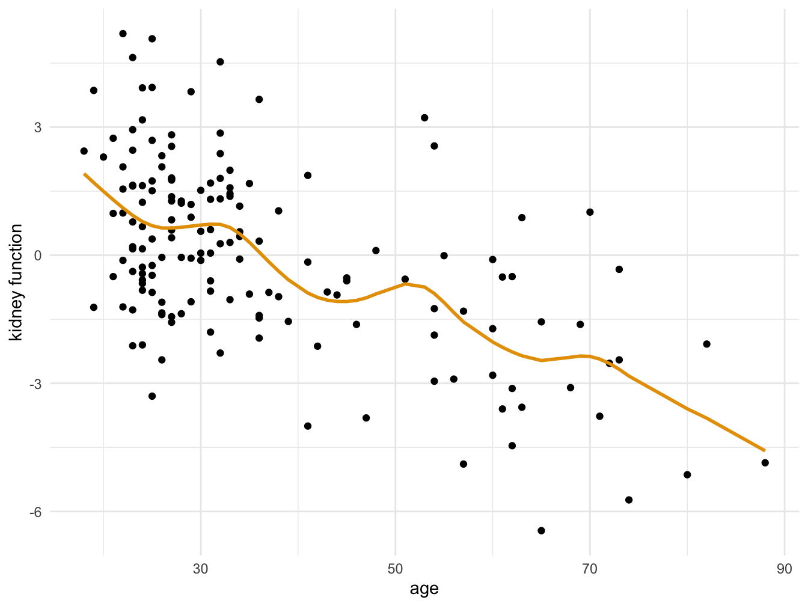

# Bootstrap {#ch-bootstrap}

This chapter's main topic is a method for measuring the accuracy of sample estimates. Recall that in frequentist statistics we consider the variability of an estimate as we imagine that we draw new samples from the same distribution. In reality we only have one sample and so the solution has been to assume a distribution of the observations and theoretically derive the sampling distribution of the estimator. For example this is what we did using asymptotic approximations in the first chapter.

In this chapter we introduce the *Bootstrap* as an alternative way of finding the accuracy of an estimator. Instead of assuming a distribution of the observations, we will let the sample represent the whole sampling distribution. In that way we can get repeated approximate samples from the sampling distribution by resampling with replacement from the sample. This is a powerful method that lets us estimate standard deviations and construct confidence intervals even for complicated estimators, with very little effort.

But first we will discuss the distinction between parametric and non-parametric statistics.

Readings for this chapter is:

AOS 7, 8

ISLR 5.2

## Parametric vs non-parametric

What we have seen so far has been parametric models. For example we could have a normal model, $X\sim \mathsf N(\mu,\sigma^2)$, and the goal would be to make some statement regarding the parameters $\mu$ and $\sigma^2$.

For a non-parametric model we only say that our sample is an observation from some distribution, with distribution function $F$ and our goal is to make statements about some property of that distribution. For example we might want to estimate the mean of that distribution.

We call these properties functionals of the distribution. Since if we knew the distribution, they could be calculated. For example the mean,
$$
\mu = T(F) = \int x dF(x).
$$
Here, $T(F)$ is just expressing the fact that $\mu$ is calculated from the distribution function $F$. The integral is a convenient way of writing integration with respect to a distribution in a general way. For example, if the distribution is continuous, recall that the density is
$$
f(x) = \frac{dF(x)}{dx}.
$$
Written in another way:
$$
dF(x) = f(x)dx.
$$
Then the formula above just becomes
$$
\mu = \int xf(x)dx,
$$
which we recognize as the mean of a distribution. If $F$ is the distribution function of a discrete distribution, $dF(x)$ can be thought of as the probability function, and the mean is
$$
\mu = \int xdF(x) = \sum_x xp(x).
$$
Another example is the variance,
$$
T(F) = \int x^2dF(x) - \left( \int xdF(x) \right)^2.
$$
Also for example the median can of course be calculated, at least in principle, if one knows the distribution and can therefore be written as a functional. Recall that the median is the number $m$ that satisfies, at least if $F$ is continuous,
$$
F(m) \equiv P(X\leq m) = 1/2.
$$
So that,
$$
F^{-1}(1/2) = F^{-1}(F(m)) = m.
$$
More generally, assuming that $F$ is strictly increasing, the $p$th quantile is $T(F) = F^{-1}(p).$ Again, this is a functional of $F$.

## Non-parametric estimation

We start by defining the empirical distribution function.
\BeginKnitrBlock{note}<div class="note">The empirical distribution function $\hat F_n$ is the distribution function that puts mass $1/n$ at each data point $x_i$. That is,
$$
  \hat F_n(x) = \frac{\sum_{i=1}^n I(x_i\leq x)}{n},
$$
where
$$
I(x_i\leq x) =
  \begin{cases} 
   1 & \text{if } x_i \leq x \\
   0       & \text{otherwise }
  \end{cases}
$$</div>\EndKnitrBlock{note}
In the example below, we draw a sample of size 100 from the $\mathsf{N}(0,1)$ distribution and plot the empirical distribution function of the sample. This can be done easily using gg-plot.

```r
set.seed(42)
data.df <- data.frame( x = rnorm(100) )

library(ggplot2)
cbp1 <- c("#999999", "#E69F00", "#56B4E9", "#009E73",
          "#F0E442", "#0072B2", "#D55E00", "#CC79A7")

ggplot(data.df, aes(x)) +
  stat_function(fun = pnorm, color = cbp1[2], size = 1) +
  stat_ecdf(geom = "step", size = 1) +
  labs( y = "F(x)", x = "x") + 
  theme_minimal()
```

<div class="figure" style="text-align: center">

<p class="caption">(\#fig:empiricalDistrFcnExample)Empirical and true distribution function</p>
</div>

<p>Now we may estimate any parameter that is a functional of $F$ by simply replacing $F$ by $\hat F_n$.</p>
\BeginKnitrBlock{note}<div class="note">The plug-in estimator of $\theta = T(F)$ is defined by
$$
  \hat\theta_n = T(\hat F_n).
$$</div>\EndKnitrBlock{note}
Let us consider functionals that can be written as
$$
T(F) =  \int r(x) dF(x),
$$
for some function $r$. Clearly the mean and the variance are examples of this. Then the plug-in estimator is
$$
T(\hat F_n) = \int r(x)d\hat F_n(x).
$$
Since the empirical distribution is a discrete distribution that puts mass $1/n$ at each point $x_i$, the corresponding  empirical probability function is,
$$
\hat p_n(x) =
  \begin{cases} 
   1/n & \text{if } x = x_i \text{ some } i \\
   0       & otherwise
  \end{cases}
$$
The function can then be written:
$$
T(\hat F_n) = \int r(x) d\hat F_n(x) = \sum_{i=1}^n r(x_i) \hat p_n(x_i) = \frac{1}{n} \sum_{i=1}^n r(x_i).
$$
The plug-in estimates of such functionals is therefore simple to calculate. For example,
\begin{align}
\hat \mu &= \mu(\hat F_n) =\int x d\hat F_n(x) = \frac{1}{n} \sum_{i=1}^n x_i,\\
\hat \sigma^2 &= \sigma^2(\hat F_n) = \int x^2 d\hat F_n(x) - \left(\int xd\hat F_n(x)  \right)^2 = \frac{1}{n}\sum_{i=1}^n x_i^2 + \left( \frac{1}{n}\sum_{i=1}^n x_i\right)^2 = \frac{1}{n}\sum_{i=1}^n (x_i -\bar x)^2.
\end{align}

The plug in estimator of the $p$th quantile becomes the $p$th sample quantile:
$$
\hat F_n^{-1}(p) =  \inf \left\{ x \mid \hat F_n(x)\geq p \right\}.
$$
That is, it is the smallest $x$ such that $\hat F_n(x)\geq p$. Looking at the picture it seems as in our sample, for example, $\hat F_n^{-1}(0.75)\approx 0.7$. Calculating precisely:

```r
quantile(data.df$x, probs = c(0.75), type = 1)
```

```
##       75% 
## 0.6556479
```


## Bootstrap

In this section we discuss how to calculate standard errors and confidence intervals for a statistic $T(X_1,X_2,\ldots, X_n)$. But first let us take a step back and consider the basics of what we are doing.

We are given a sample $(x_1,\ldots, x_n)$. We have some function, $T$, that we apply to the sample and call a statistic. This may be a simple function like the sample mean, or some more complicated function like a parameter in a regression problem. We apply the function to the data and get a number $t=T(x_1,\ldots,x_n)$. To do inference we also need to know the variability of that number if we were to repeat the same experiment. We therefore consider the random variable $T_n := T(X_1,\ldots, X_n)$, where $X_i\overset{iid}{\sim }F$. The distribution of this random variable is called the sampling distribution. In some cases, for a particular $T$ and $F$, we may be able to find the sampling distribution either exactly or approximately. For example, we previously found the asymptotic sampling distribution of the maximum likelihood estimate. Once we have that, we can do hypothesis testing, construct confidence intervals or simply state the standard deviation. The procedure can be summarized as:
$$
F\overset{sample}{\to} x \overset{T}{\to} t.
$$

However, in many cases the calculation of the sampling distribution is not possible and one way to instead approximate the distribution is through simulation. For now, let us assume that we know the distribution $F$. Then it may be possible to draw $n$ iid copies of the random variable $X_1^\star,\ldots X^\star_n \overset{iid}{\sim} F$ using a computer. Then calculate $t^\star = T(X_1^\star,\ldots X^\star_n)$. Repeat this $B$ times to obtain $t_1^\star,\ldots, t_B^\star$. 

If we have $B$ such copies, by the large of large numbers, as $B\to \infty$,
\begin{equation}
\frac{1}{B}\sum_{i=1}^B f(t_i^\star)\overset{asym.}\sim  E\left[ f(T_n) \right]. (\#eq:MCapproximation)
\end{equation}
So that in practice, we would approximate the right hand side with the left hand side. The most important example is the variance:
$$
Var\left( T_n \right) = E\left[T_n^2\right] - E\left[T_n\right]^2 \approx \frac{1}{B}\sum_{i=1}^B (t_i^\star)^2 - \left( \frac{1}{B}\sum_{i=1}^B t_i^\star \right)^2 = \frac{1}{B}\sum_{i=1}^B \left( t_i^\star - \bar{t^\star} \right)^2
$$ 

As an example, let us consider $X_1,\ldots, X_{n}\overset{iid}\sim \mathsf{Exp}(1)$. We would like to know the distribution of the sample median and in particular the expected value and variance.

```r
n <- 100
B <- 1000

T <- median

tstar <- array(dim = B)

for (i in seq_len(B)) {
  x <- rexp(n, rate = 1)
  tstar[i] <- T(x)
}

mean(tstar)
```

```
## [1] 0.6964009
```

```r
var(tstar)
```

```
## [1] 0.01063886
```

In practice this is not helpful since we rarely know $F$. What we have is $\hat F_n$, so let us approximate $F\approx \hat F_n$ and therefore also $Var_F(T_n) \approx Var_{\hat F_n}(T_n)$. The right hand side here is then the variance of $T(X_1,\ldots , X_n)$, where $X_i$ is iid and distributed as $\hat F_n$. Then we proceed as above: Draw $n$ iid copies of the random variable $X^\star_1,\ldots X^\star_n \sim \hat F_n$ using a computer. Then calculate $t^\star = T(X_1^\star,\ldots X^\star_n)$. Repeat this $B$ times to obtain $t_1^\star,\ldots, t_B^\star$. Here, since $\hat F_n$ is the empirical distribution, drawing from $\hat F_n$ means simply to draw an observation at random from the original data set. In contrast to the above, this method can be summarized as:
$$
\hat F_n\overset{sample}{\to} x^\star \overset{T}{\to} t^\star.
$$

This method is called the bootstrap.

\BeginKnitrBlock{note}<div class="note">Bootstrap variance estimation:
Choose $B$ as a large number, then for $b=1,\ldots, B$
  
1. Draw $X_1^\star,\ldots, X_n^\star \overset{iid}{\sim} \hat F_n$.
2. Compute $t_b^\star = T(X_1^\star,\ldots, X_n^\star)$.
3. Approximate $Var_F(T_n)$ by
$$
  v_{boot} = \frac{1}{B}\sum_{b=1}^B\left( t^\star_{b} - \frac{1}{B}\sum_{r=1}^B t^\star_{r} \right)^2
$$</div>\EndKnitrBlock{note}
<p>To be clear, step 1 above, draw $X_1^\star,\ldots, X_n^\star \overset{iid}{\sim} \hat F_n$, simply means to draw one of the observations in the sample randomly and call it $X_1^\star$. Put the observation back in the sample and independently draw another observation, call it $X_2^\star$ and so on.</p>

Let us implement this method to calculate the standard error of the median using the normally distributed data set from the previous section:

```r
T <- median
n <- nrow(data.df)
B <- 1000

for (i in 1:B) {
  indices <- sample(seq_len(n), size = n, replace = TRUE)
  tstar[i] <- T(data.df$x[indices])
}

sd(tstar)
```

```
## [1] 0.1564483
```
In practice we would rather use the boot library.

```r
library(boot)
boot(data = data.df, 
     statistic = function(data, index){ T(data$x[index]) }, 
     R = 1000)
```

```
## 
## ORDINARY NONPARAMETRIC BOOTSTRAP
## 
## 
## Call:
## boot(data = data.df, statistic = function(data, index) {
##     T(data$x[index])
## }, R = 1000)
## 
## 
## Bootstrap Statistics :
##       original     bias    std. error
## t1* 0.08979677 0.03632407   0.1475442
```
Note that the two bootstrap functions do not give exactly the same result. This is because of the Monte Carlo error, i.e.\ the error in approximating the sample mean with the expected value as in Equation \@ref(eq:MCapproximation).

Since here we know $F$ we can calculate the standard deviation by simulating from $F$, an alternative not available in practice.

```r
n <- nrow(data.df)
B <- 1000
Tsim <- array(dim = B)

for (i in 1:B) {
  simData.df <- data.frame( x = rnorm(n) )
  Tsim[i] <- T(simData.df$x)
}

sd(Tsim) #Standard error of median
```

```
## [1] 0.1253581
```

It is also possible to construct confidence intervals using bootstrap. Here we present bootstrap pivotal confidence intervals, sometimes known as basic bootstrap intervals.

Let us call $T(F) = \theta$ and $T(\hat F_n )=\hat\theta_n$ and define the pivot $R_n = \hat\theta_n - \theta$. Write the distribution function of $R_n$ as:
$$
H(r) := P(R_n\leq r).
$$
Then,
\begin{align}
&P\left(\hat\theta_n - H^{-1}(1-\alpha/2)\leq \theta \leq \hat\theta_n - H^{-1}(\alpha/2)\right) \\
=& P\left( H^{-1}(\alpha/2) \leq \hat\theta_n - \theta \leq  H^{-1}(1-\alpha/2) \right)\\
=& P\left( H^{-1}(\alpha/2) \leq R_n \leq  H^{-1}(1-\alpha/2) \right)\\
=& H\left( H^{-1}(1-\alpha/2) \right) - H\left( H^{-1}(\alpha/2) \right)\\
=& 1-\frac{\alpha}{2}-\frac{\alpha}{2} = 1-\alpha,
\end{align}
proving that
$$
\left[\hat\theta_n - H^{-1}(1-\alpha/2) , \hat\theta_n - H^{-1}(\alpha/2) \right]
$$
is a $1-\alpha$ CI for $\theta$.

Now, since $H$ is unknown this is not practical. We can however construct a bootstrap estimate of $H$ by drawing $R^\star_{n,b} = \hat\theta^\star_{n,b}- \hat\theta_n$ and defining:
$$
\hat H(r) = \frac{1}{B}\sum_{b=1}^B I(R^\star_{n,b}\leq r).
$$
The quantity $H^{-1}(\alpha)$ is the $\alpha$ quantile of $H$. In the CI we replace $H^{-1}$ by $\hat H^{-1}$, i.e.\ the $\alpha$ quantile of $R^\star_{n,b}$. Since $\hat \theta_n$ is fixed in the bootstrap sample, the $\alpha$ quantile of $R^\star_{n,b}$ is simply $\theta_\alpha^\star - \hat\theta_n$, where $\theta_\alpha^\star$ denotes the $\alpha$ quantile of $\hat\theta^\star_{n,b}$.

Finally we get that the $1-\alpha$ bootstrap pivotal CI is
$$
C_n = \left[ \hat\theta_n - (\theta^\star_{1-\alpha/2} - \hat\theta_n) , \hat\theta_n - (\theta^\star_{\alpha/2} - \hat\theta_n) \right] = \left[ 2\hat\theta_n - \theta^\star_{1-\alpha/2} , 2\hat\theta_n -\theta^\star_{\alpha/2}  \right]
$$
Let us implement this on the same data set as above.

```r
alpha <- 0.05
T <- median
n <- nrow(data.df)
B <- 1000
tstar <- array(dim = B)

for (i in seq_len(B)) {
  indices <- sample(seq(1:n), size = n, replace = TRUE)
  tstar[i] <- T(data.df$x[indices])
}

q <- unname( quantile(tstar, probs = c(1-alpha/2, alpha/2)) )

lowerCI <- 2*T(data.df$x) - q[1]
lowerCI
```

```
## [1] -0.2250317
```

```r
upperCI <- 2*T(data.df$x) - q[2]
upperCI
```

```
## [1] 0.3515109
```

Even simpler is to use the boot library.

```r
library(boot)
boot.result<- boot(data = data.df, 
                   statistic = function(data, index) T(data$x[index]), 
                   R = 1000)

boot.ci(boot.result, type = "basic")
```

```
## BOOTSTRAP CONFIDENCE INTERVAL CALCULATIONS
## Based on 1000 bootstrap replicates
## 
## CALL : 
## boot.ci(boot.out = boot.result, type = "basic")
## 
## Intervals : 
## Level      Basic         
## 95%   (-0.2389,  0.3129 )  
## Calculations and Intervals on Original Scale
```

A better alternative which we do not cover in this course is the bias-corrected CI. It is however just as easy to use.

```r
library(boot)
boot.result<- boot(data = data.df, 
                   statistic = function(data, index) T(data$x[index]), 
                   R = 1000)

boot.ci(boot.result, type = "bca")
```

```
## BOOTSTRAP CONFIDENCE INTERVAL CALCULATIONS
## Based on 1000 bootstrap replicates
## 
## CALL : 
## boot.ci(boot.out = boot.result, type = "bca")
## 
## Intervals : 
## Level       BCa          
## 95%   (-0.1333,  0.3701 )  
## Calculations and Intervals on Original Scale
```

## Parametric bootstrap

Here we discuss an alternative to the (non-parametric) bootstrap from the previous section.

The main idea of the bootstrap was that the empirical distribution $\hat F$ is (hopefully) close to the actual distribution $F$. Another method of finding an approximation to $F$ is to take some family of distributions, parametrised by a parameter $\theta$, $F_\theta$, and find the $\theta$ that agrees the best with the observed sample. For example by choosing $\theta = \hat\theta_{ML}$.

Then we proceed as before. We may now sample from $\hat F = F_{\hat\theta}$ and estimate variances and construct confidence intervals as before. 

As an example, let us say that we have a random sample from $\mathsf N(\mu,\sigma^2)$ and wish to estimate the variance of the median of the sample. We then estimate $\mu$ and $\sigma^2$ with the ML-estimates and let $\hat F = \mathsf N(\hat \mu,\hat \sigma^2)$.

Implementing this is not complicated.

```r
T <- median
n <- nrow(data.df)
B <- 1000

mu.hat <- mean(data.df$x)
sigma.hat <- sd(data.df$x)

for (i in 1:B) {
  bootstrap.sample <- rnorm(n, mean = mu.hat, sd = sigma.hat)
  tstar[i] <- T(bootstrap.sample)
}

sd(tstar)
```

```
## [1] 0.1272958
```


## An application

Here we present an application of what we have learned in this chapter. The application is based on an example in @efron2016computer.

The data set consists of measurements on the kidney function of 157 individuals. We fit a smoothing spline to the data and plot.

```r
kidney.df <- read.table("data/kidney.dat", header = TRUE)

kidney.spline <- smooth.spline(kidney.df$age, kidney.df$tot, df = 10)

kidney.df$spline <- predict(kidney.spline, x = kidney.df$age)$y

library(ggplot2)
cbp1 <- c("#999999", "#E69F00", "#56B4E9", "#009E73",
          "#F0E442", "#0072B2", "#D55E00", "#CC79A7")

ggplot(kidney.df, aes(x = age, y = tot)) +
  geom_point() +
  geom_line(aes(y = spline), color = cbp1[2], size = 1) +
  labs( y = "kidney function", x="age") + 
  theme_minimal()
```

<div class="figure" style="text-align: center">

<p class="caption">(\#fig:kidneyData)Kidney function vs age</p>
</div>


<p>Now we can predict the kidney function of a new individual of age 50.</p>

```r
predict(kidney.spline, x = 50)$y
```

```
## [1] -0.7232874
```
Let us use bootstrap to find the standard deviation of this prediction and construct a CI.

```r
library(boot)

T <- function(data,index){
  s <- smooth.spline(data$age[index], data$tot[index], df = 10)
  predict(s, x = 50)$y
}

boot.result<- boot(data = kidney.df, statistic = T, R = 1000)
boot.result
```

```
## 
## ORDINARY NONPARAMETRIC BOOTSTRAP
## 
## 
## Call:
## boot(data = kidney.df, statistic = T, R = 1000)
## 
## 
## Bootstrap Statistics :
##       original    bias    std. error
## t1* -0.7232874 0.0455268   0.6037417
```

```r
boot.ci(boot.result, type = "bca")
```

```
## BOOTSTRAP CONFIDENCE INTERVAL CALCULATIONS
## Based on 1000 bootstrap replicates
## 
## CALL : 
## boot.ci(boot.out = boot.result, type = "bca")
## 
## Intervals : 
## Level       BCa          
## 95%   (-2.0496,  0.3520 )  
## Calculations and Intervals on Original Scale
```

## Summary

Perhaps the most complicated section in this chapter is the derivation of the form of the basic bootstrap interval. In this section we see that it is actually just a more general case of the normally distributed CIs that we have seen in previous courses.

We wish to form a confidence interval for the parameter $\theta$ that we estimate by $\hat \theta$. We will assume that $R:= \hat \theta - \theta \sim \mathsf N(0,\sigma^2)$. Recall that the usual $1-\alpha$ confidence interval is
$$
\left[ \hat\theta - \sigma z_{\alpha/2}, \hat\theta + \sigma z_{\alpha/2}  \right].
$$

Let, as for the bootstrap confidence, $H$ be the distribution function of $R$, that is
$$
H(z) = P(R\leq z) = P(\hat\theta - \theta \leq z) = P\Big(\frac{\hat\theta - \theta}{\sigma}\leq \frac{z}{\sigma}\Big) = \Phi(z/\sigma),
$$
where $\Phi$ denotes the distribution function of the standard normal distribution.

Now, if we choose $z = H^{-1}(\alpha)$, then
$$
\alpha = H(H^{-1}(\alpha)) = \Phi\left( \frac{H^{-1}(\alpha)}{\sigma} \right).
$$
Now apply $\Phi^{-1}$ on both sides,
$$
\Phi^{-1}(\alpha) = \frac{H^{-1}(\alpha)}{\sigma}.
$$

The number $z_\alpha$ is by definition the number such that $\Phi(-z_\alpha) = \alpha$, or stated differently $\Phi^{-1}(\alpha) = -z_\alpha$. Then we have that
$$
\sigma z_{\alpha/2} = -\sigma\Phi^{-1}(\alpha/2) = -H^{-1}(\alpha/2).
$$
Therefore the upper limit of the CI can be written
$$
\hat \theta + \sigma z_{\alpha/2} = \hat \theta -H^{-1}(\alpha/2).
$$

We conclude that the basic bootstrap interval is of the same form as the usual normal CI. The lower limit can be obtained with similar calculations. In the bootstrap interval the next step was to replace the unknown $H$ with a bootstrap estimate.

## Review questions

1. When writing $\int x dF(x)$, what does $dF(x)$ mean?
2. In terms of the distribution function $F$, what is the median of a distribution?
3. What is the empirical distribution function?
4. What is a plug-in estimator?
5. In bootstrap, what is $X_1^*$?
6. What does it mean, in practice, when we write $X_1^*,\ldots,X_n^*\sim \hat F_n$?
7. How is the basic bootstrap interval calculated?
8. What is the difference between parametric and non-parametric bootstrap?
