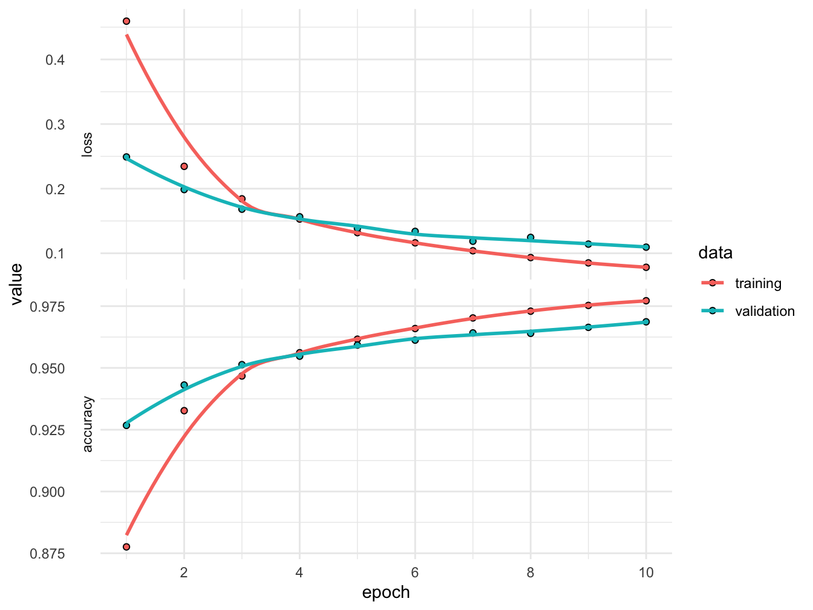
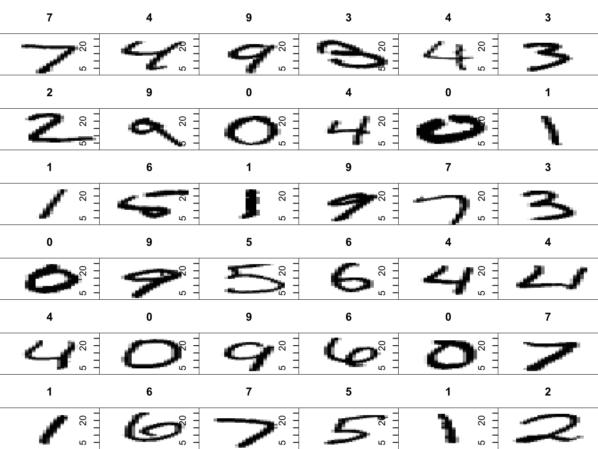

# Beyond linearity

In this module we cover some state-of-the-art non-linear models. Decision trees, bagging, random forest and boosting is covered well in ISLR, so we will no repeat it here. But it is part of the course.

The new version of ISLR also includes a chapter on deep learning. The first part of this chapter is also part of the course

Readings for this chapter is therefore:

ISLR 8

ISLR 10.1-3 and 10.6-7

## An application I

Let us see an example of how to implement a neural network classifier. We will use Keras, which is just a wrapper for the machine learning library *Tensorflow*. You may find the [documentation](https://tensorflow.rstudio.com) useful

Our goal is to classify hand-written digits from the MNIST database, which is conveniently included in Keras. The first time you install Keras, you do.

```r
install.packages("keras")
library(keras)
install_keras(envname = "r-reticulate")
```
If you get a prompt asking to install miniconda, you should choose "Yes".

If this installation fails another option is to follow the instructions at the [ISLR webpage](https://web.stanford.edu/~hastie/ISLR2/keras-instructions.html)

After that, it should be enough to

```r
library(keras)
```
The MNIST database is already divided in a training and a test set

```r
mnist <- dataset_mnist()

x_train <- mnist$train$x
y_train <- mnist$train$y
x_test <- mnist$test$x
y_test <- mnist$test$y
```
Let us see what the pictures look like.
<div class="figure" style="text-align: center">

<p class="caption">(\#fig:mnist1)Examples from MNIST</p>
</div>
Each image is represented as a 28x28 matrix of pixel values between 0 and 255. We reshape each matrix in to a vector and scale the pixel value so that it is between 0 and 1.

```r
dim(x_train) <- c(nrow(x_train), 784)
dim(x_test) <- c(nrow(x_test), 784)

x_train <- x_train / 255
x_test <- x_test / 255
```
The $y$ variables are given as an integer between 0 and 9. We transform it to a vector of dummy variables.

```r
y_train <- to_categorical(y_train, 10)
y_test <- to_categorical(y_test, 10)
```
Now we specify a 2-layer NN with Relu activation in the hidden layer and softmax in the last layer.

```r
model <- keras_model_sequential()
model %>%
  layer_dense(units = 50, activation = "relu", input_shape = c(784)) %>%
  layer_dense(units = 10, activation = "softmax")
```
We compile the model by specifying the loss and the optimization method.

```r
model %>% compile(
  loss = "categorical_crossentropy",
  optimizer = optimizer_rmsprop(),
  metrics = c("accuracy")
)
```
Here, cross entropy loss is just the negative of a multinomial log likelihood. The optimizer, RMSprop, is a way of choosing the learning rate adaptively. Now we train the NN.

```r
history <- model %>% fit(
  x_train, y_train,
  epochs = 10, batch_size = 128,
  validation_split = 0.2
)
```
Here we use 20‰ as a validation set. Usually NN does not include a regularization term and so there is a risk of overfitting. Instead one usually restricts the number of epochs and the optimization algorithm is not run until convergence. This is called *early stopping*.
<div class="figure" style="text-align: center">

<p class="caption">(\#fig:mnistHistory)Training and validation loss/accuracy for each epoch</p>
</div>
We see that the validation accuracy is still increasing, so we could probably run more epochs. Let us evaluate the model on the test set.

```r
model %>% evaluate(x_test, y_test,verbose = 0)
```

```
##      loss  accuracy 
## 0.1046593 0.9707000
```
The accuracy is 97%, which is not too bad. Let us make predictions on the test set and plot some of them.
<div class="figure" style="text-align: center">

<p class="caption">(\#fig:mnist2)Predictions on the test set</p>
</div>

## An application II

In this section we demonstrate how to use boosting to predict the salary of baseball players using the Hitters dataset.

We start by loading the required packages and splitting the data into a training and test set


```r
library(caret)
library(ISLR2)
library(tidyverse)
library(gbm)

Hitters <- na.omit(Hitters)

set.seed(3)
training.samples <- caret::createDataPartition(Hitters$Salary, 
                                               p = 0.7, 
                                               list = FALSE)
train.data  <- Hitters[training.samples, ]
test.data <- Hitters[-training.samples, ]
```

Boosting has a number of different parameters and we use a grid search and cross-validation to find the best choice.

```r
gbmGrid <- expand.grid(interaction.depth = c(1, 2, 3),
                       n.trees = (1:20)*2000,
                       shrinkage = 0.001,
                       n.minobsinnode = 5)

fitControl <- trainControl(
  method = "repeatedcv",
  number = 5,
  repeats = 5
  )
```

The performance of the model is usually better the smaller the shrinkage parameter, or learning rate, is chosen. But with a small shrinkage we need many iterations, i.e. trees. So there is a tradeof between performance and the time it takes to train the model and the amount of storage required.

To speed up the training we use parallel processes.

```r
library(doParallel)
cl <- makePSOCKcluster(4)
registerDoParallel(cl)
```
Now we fit the model

```r
gbmFit <- train(
  Salary ~ ., 
  data = train.data, 
  method = "gbm", 
  trControl = fitControl,
  verbose = FALSE,
  distribution = "gaussian",
  tuneGrid = gbmGrid
  )
```
Here, gaussian means that we are doing regression that minimizes the square error.

We may know predict the observations in the test set and calculate the out-of-sample error.


```r
predictions <- predict(gbmFit, test.data)
sqrt(mean((predictions - test.data$Salary)^2))
```

```
## [1] 308.2421
```
This is an improvement over the regularized linear regression we did previously.

We can also see the importance of each variable.

```r
vip::vip(gbmFit) +
  theme_minimal()
```


By making a partial dependence plot we can illustrate how each variable affect the prediction on average.

```r
gbmFit$finalModel %>%
  pdp::partial(
    pred.var = "CHmRun", 
    n.trees = gbmFit$finalModel$n.trees, 
    grid.resolution = 100,
    train = train.data,
    plot = TRUE,
    rug = TRUE,
    plot.engine = "ggplot2") +
  theme_minimal()
```


## Review questions

- What parts does a decision tree consist of?
- What types of decision trees are there?
- How does recursive binary splitting work?
- What is tree pruning?
- What are the steps in bagging?
- How do random forests improve on bagged decision trees?
- What is the basic idea behind boosting?
- What are the pros and cons of tree-based models vs linear models?
- What are the pros and cons of plain decision trees vs ensemble methods in decision trees?
- What parts does a neuron consist of?
- What is an activation function?
- What is a ReLU?
- What is the softmax function?
- What is a layer?
- What is gradient descent?
- What is a mini-batch?
- What is an epoch?
- What is backpropagation?
- How are NNs usually regularized?
- What are some popular neural network architectures?
- How can transfer learning be used in neural networks?
- How does early stopping work?

